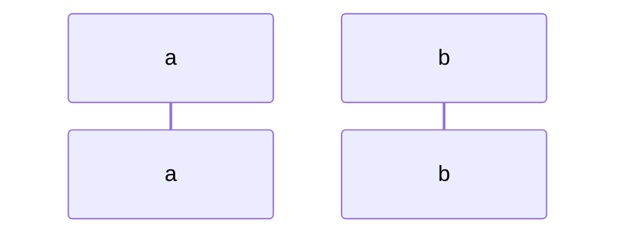
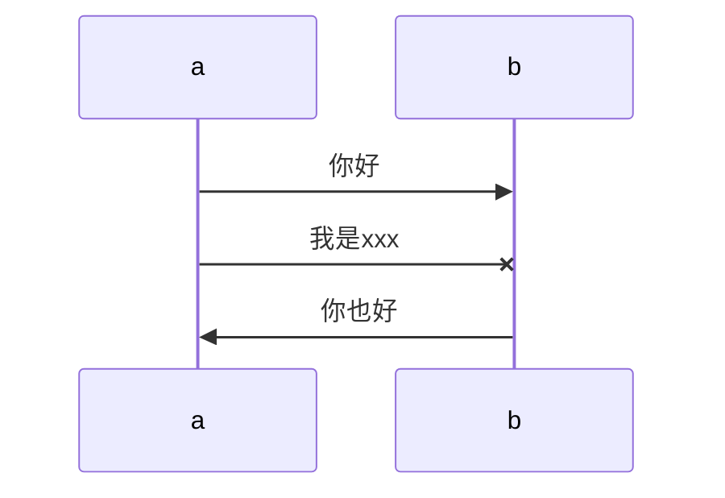
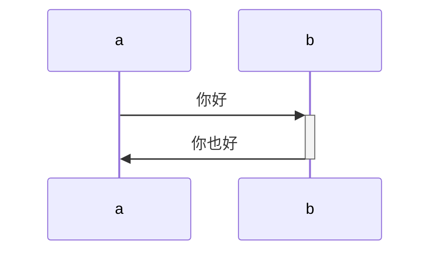
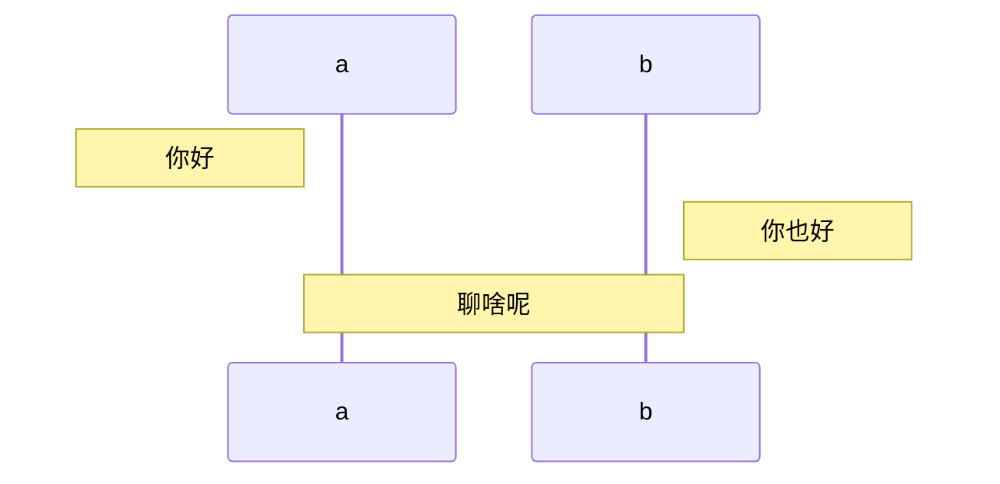
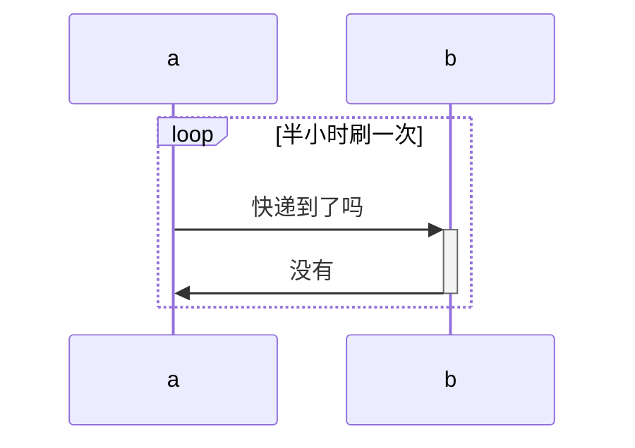
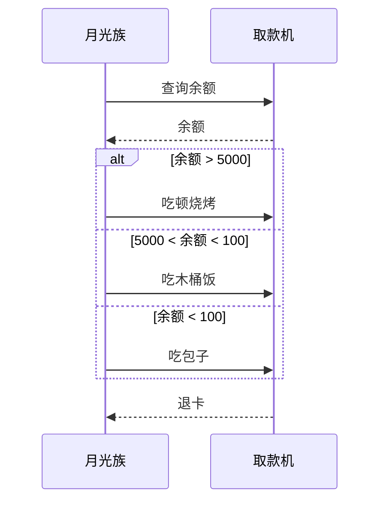
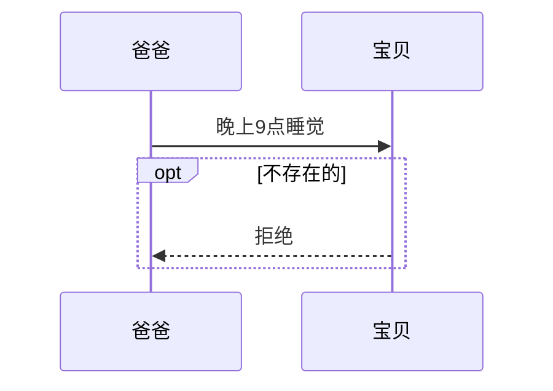
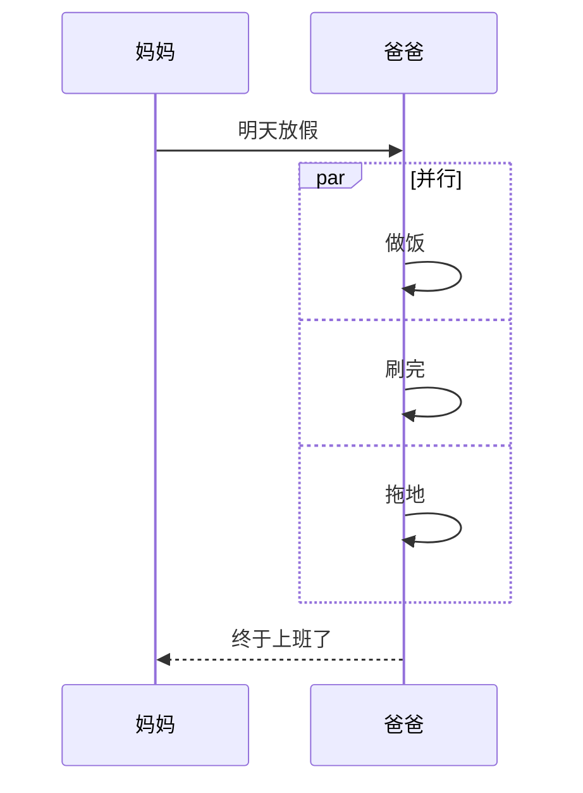

## 参与者
```
sequenceDiagram 为每幅时序图的固定开头
participant <参与者名称> 声明参与者，语句次序即为参与者横向排列次序

例如：
sequenceDiagram
	participant a
	participant b
```

## 消息
```
交互时一方对另一方的操作（比如接口调用）或传递出的信息。用单向箭头来表示——实线代表主动发出消息；虚线代表响应；末尾带「X」代表异步消息，无需等待回应
消息语句格式为：<参与者> <箭头> <参与者> : <描述文本>。
其中 <箭头>的写法有：
->> 显示为实线箭头（主动发出消息）
-->>显示为虚线箭头（响应）
-x显示为末尾带「X」的实线箭头（异步消息）

例如：
sequenceDiagram
	participant a
	participant b
		a ->> b : 你好
		a -x b : 我是xxx
		b ->> a : 你也好
```

## 激活框
```
从消息接收方的时间线上标记一小段时间，表示对消息进行处理的时间间隔。

例如：
sequenceDiagram
	participant a
	participant b
		a ->> + b : 你好
		b ->> - a : 你也好
```


## 注解

```
例如：
sequenceDiagram
	participant a
	participant b
		note left of a : 你好
		note right of b : 你也好
		note over a,b : 聊啥呢
```



## 循环loop
```
在条件满足时，重复发出消息序列。相当于编程语言中的 while 语句

例如：
sequenceDiagram
	participant a
	participant b
		loop 半小时刷一次
			a ->> + b : 快递到了吗
			b ->> -a : 没有
		end
```



## 选择alt

```
在多个条件中作出判断，每个条件将对应不同的消息序列。相当于 if 及 else if 语句

例如：
sequenceDiagram    
    月光族 ->> 取款机 : 查询余额
    取款机 -->> 月光族 : 余额
    
    alt 余额 > 5000
        月光族 ->> 取款机 : 吃顿烧烤
    else 5000 < 余额 < 100
        月光族 ->> 取款机 : 吃木桶饭
    else 余额 < 100
        月光族 ->> 取款机 : 吃包子
    end
    
    取款机 -->> 月光族 : 退卡
```

## 可选opt
```
在某条件满足时执行消息序列，否则不执行。相当于单个分支的 if 语句

例如：
sequenceDiagram
    爸爸 ->> 宝贝 : 晚上9点睡觉
    
    opt 不存在的
        宝贝 -->> 爸爸 : 拒绝
    end
```

## 并行par
```
将消息序列分成多个片段，这些片段并行执行

例如：
sequenceDiagram
    妈妈 ->> 爸爸 : 明天放假
    
    par 并行
        爸爸 ->> 爸爸 : 做饭
    and
        爸爸 ->> 爸爸 : 刷完
    and
        爸爸 ->> 爸爸 : 拖地
    end
    
    爸爸 -->> 妈妈 : 终于上班了
```


