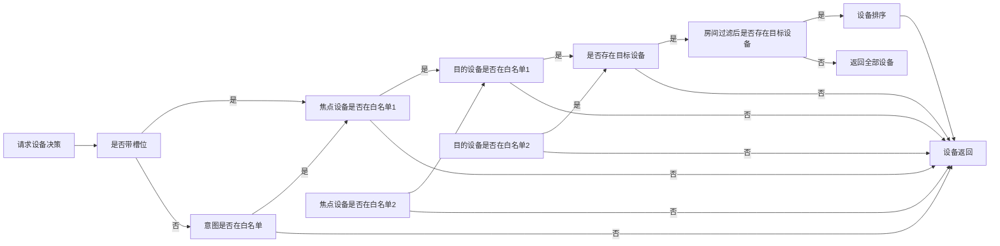

```mermaid
graph LR
请求设备决策[请求设备决策] --> 是否带槽位[是否带槽位]
是否带槽位 --> |是| 焦点设备是否在白名单1[焦点设备是否在白名单1]
是否带槽位 --> |否| 意图是否在白名单[意图是否在白名单]
意图是否在白名单 --> |是| 焦点设备是否在白名单1
焦点设备是否在白名单2 --> |是| 目的设备是否在白名单1
目的设备是否在白名单2 --> |是| 是否存在目标设备
目的设备是否在白名单2 --> |否| 设备返回
焦点设备是否在白名单2 --> |否| 设备返回
意图是否在白名单 --> |否| 设备返回
焦点设备是否在白名单1 --> |是| 目的设备是否在白名单1
焦点设备是否在白名单1 --> |否| 设备返回
目的设备是否在白名单1 --> |是| 是否存在目标设备
目的设备是否在白名单1 --> |否| 设备返回
是否存在目标设备 --> |是| 房间过滤后是否存在目标设备
是否存在目标设备 --> |否| 设备返回
房间过滤后是否存在目标设备 --> |是| 设备排序
房间过滤后是否存在目标设备 --> |否| 返回全部设备
设备排序 --> 设备返回
```

