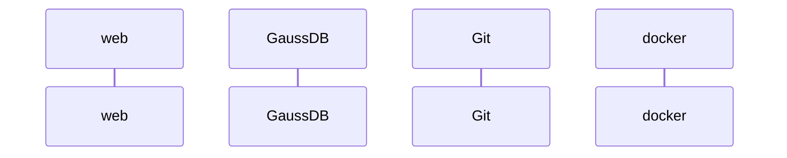
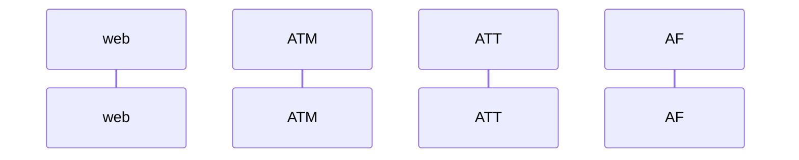
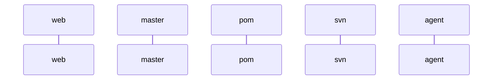

## 个人简介

你好，我来自湖北咸宁，是一名软件测试工程师，目前就职于某大型互联网公司

## 技能清单

| 专业技能                        | 熟悉程度  |
| --------------------------- | ----- |
| Linux操作系统                   | ★★★☆☆ |
| Python编程                    | ★★★☆☆ |
| Java编程                      | ★★☆☆☆ |
| RESTful API自动化测试            | ★★★★☆ |
| 软件测试设计                      | ★★★☆☆ |
| IP路由                        | ★★★☆☆ |
| HTTP/FTP/SNMP/DNS协议         | ★★☆☆☆ |
| unittest/Selenium/Watir测试框架 | ★★★☆☆ |

## 项目经验

### 基于Java+TestNG的RESTful API自动化测试

### 基于Ruby+CGI的应用防火墙自动化测试

### CaaS SDK分布式持续集成平台构建

